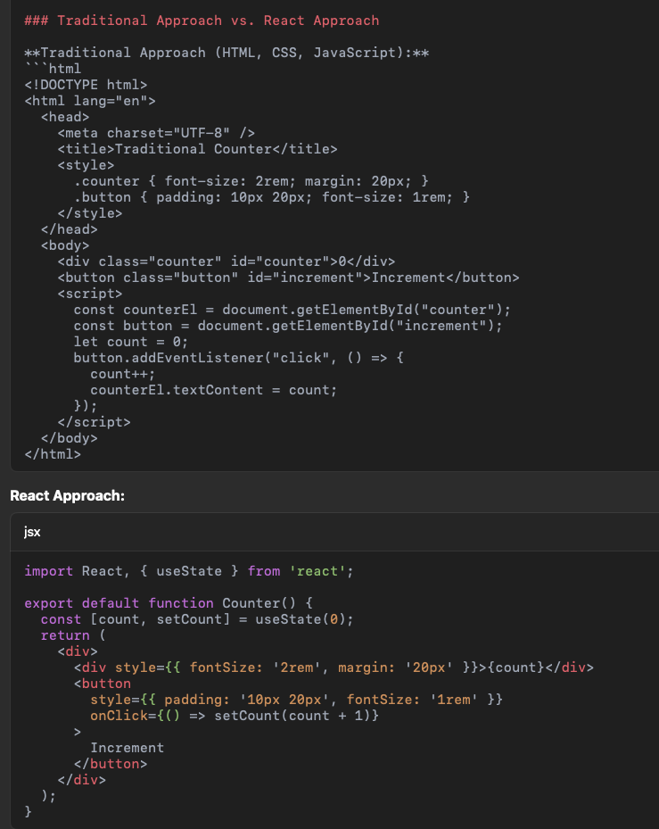

React Portfolio

This project is a personal portfolio built using React with Vite as the build tool. It leverages modern development practices like component encapsulation, the Virtual DOM, and hot module reloading for an efficient development experience.

Overview

This portfolio demonstrates:
	•	A component-based architecture where each UI element (header, intro, skills, work, etc.) is encapsulated.
	•	The use of React for managing UI state and rendering components.
	•	Vite for fast development, bundling, and hot reloading.
	•	Node.js as the runtime for running build processes and development servers.
	•	A transition from a traditional web design approach (plain HTML, CSS, and JavaScript) to a modular, reusable component-based structure.

Technologies Used
	•	React: A JavaScript library for building user interfaces through encapsulated components.
	•	Vite: A build tool that offers fast development server and bundling, optimizing your React code for production.
	•	Node.js: Provides the environment for running Vite’s development server and build scripts.
	•	Devicon: A set of developer icons (loaded via CDN) used for displaying tech stack logos.
	•	Traditional CSS & JSX: CSS is used for styling, while JSX (JavaScript XML) allows you to write HTML-like syntax in React components.

How It Works

Development
	•	Vite & Node.js
Vite is used to bundle and package your React code. It provides a fast development server with hot module replacement, making the iterative development process very efficient. Node.js runs the Vite server and build scripts, but it is not required to run the final built application.
	•	React & the Virtual DOM
React creates a lightweight, in-memory Virtual DOM representation of your UI. When state changes occur, React calculates the difference (or “diff”) between the previous and new Virtual DOM and updates only the parts of the real DOM that have changed. This efficient updating mechanism greatly improves performance compared to manually manipulating the DOM.

Production
	•	Building the App
During the build process, Vite (using Node.js) transpiles JSX into plain JavaScript, bundles all your modules, and optimizes the code for production. The final output is a set of plain JavaScript files that the browser can execute directly—while still preserving the component encapsulation and modularity through the bundling process.
	•	Encapsulation & Reusability
Unlike traditional web pages where HTML, CSS, and JavaScript are separate and global, React components encapsulate their markup, style, and behavior. This isolation reduces side effects, improves reusability, and enhances maintainability.

Comparison: Traditional Approach vs. React

Traditional Approach
	•	Structure: Separate HTML, CSS, and JavaScript files.
	•	DOM Manipulation: Directly using JavaScript (or libraries like jQuery) to update the DOM.
	•	Encapsulation: Less isolated—scripts and styles often affect the global scope.
	•	Build Process: No build process is strictly required; the browser runs HTML, CSS, and JavaScript as-is.

React Approach
	•	Structure: Components that encapsulate HTML (JSX), CSS, and behavior (state and methods).
	•	DOM Manipulation: Managed by React’s Virtual DOM and its diffing algorithm, which updates only the changed parts of the DOM.
	•	Encapsulation: Components are self-contained and reusable, reducing interference between parts of the app.
	•	Build Process: Uses tools like Vite to bundle, optimize, and transpile code into plain JavaScript that browsers can run.

A typical React + Vite project might have this structure:
  my-portfolio/
  ├── node_modules/               # Installed dependencies
  ├── public/
  │   └── index.html              # The HTML template where Vite injects scripts.
  ├── src/
  │   ├── App.css                 # Global and component-specific styles.
  │   ├── App.jsx                 # Main App component.
  │   ├── index.css               # Additional global CSS (optional).
  │   └── main.jsx                # Entry point that renders the App.
  ├── .gitignore                  # Files to ignore in git.
  ├── package.json                # Project metadata, dependencies, and scripts.
  ├── vite.config.js              # Vite configuration file.
  └── README.md                   # This file.

Running the Project Locally
1.	Install dependencies:
npm install

2.	Start the development server:
npm run dev
Open your browser at the provided URL

Building and Deploying
1.	Build the project:
npm run build

2.	Preview the production build:
npm run preview

3.	Deploy to GitHub Pages:
npm install --save-dev gh-pages

Add these scripts to package.json:
  "scripts": {
  "predeploy": "npm run build",
  "deploy": "gh-pages -d dist"
  }

Deploy:
npm run deploy

where should we put images and other resource files ?
•	Use public/assets/ for static images needed in Markdown (README.md) or directly in index.html.
•	Use src/assets/ for images dynamically imported in React components.